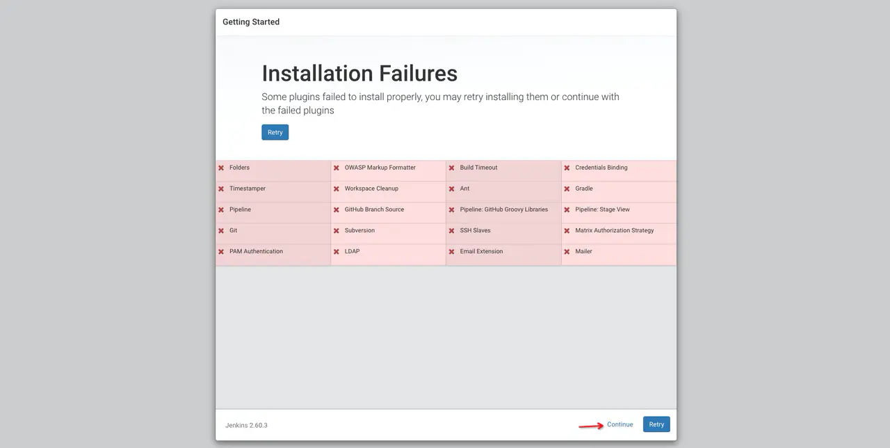
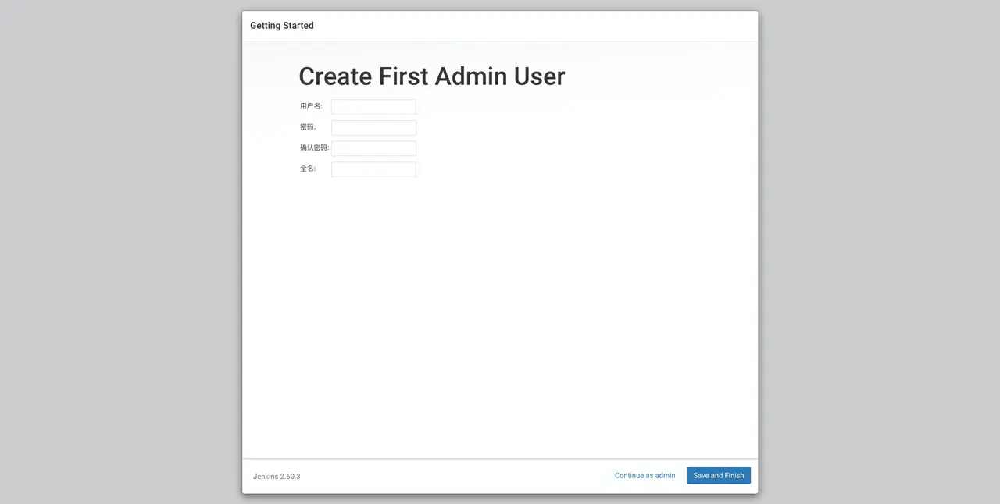

# **Jenkins安装与使用总结**

[TOC]

### **一、下载Jenkins**

docker pull jenkins/jenkins:centos7

docker pull jenkins/jenkins:2.222.3-centos

docker pull jenkins/jenkins:2.235.1-lts-centos7 （最新版-推荐）

docker官方仓库：https://hub.docker.com/r/jenkins/jenkins

Jenkins官方Docker映像文档说明：https://github.com/jenkinsci/docker/blob/master/README.md

### **二、安装Jenkins**

##### 1、创建jenkins挂载目录

​     **①** 如果存在将使用以下命令删除目录

​         rm -rf /data/share/tools/jenkins_home

​    **②**重新创建挂载目录

​        mkdir -p /data/share/tools/jenkins_home

​    **③**设置挂载目录的用户权限

​         需要修改下目录权限，因为当映射本地数据卷时，/data/share/tools/jenkins_home目录的拥有者为root用户，而容器中jenkins用户的 uid 为1000。

> ​       **`chown -R 1000:1000 /data/share/tools/jenkins_home`**
>

##### **2、启动Jenkins容器**

       docker run -d \
           --name jenkins \
           -p 2490:8080 -p 50000:50000 \
           --restart=always \
           -u 0 \
           -e LC_ALL=zh_CN.utf8 \
           -e LANG=zh_CN.utf8 \
           -e LANGUAGE=zh_CN.utf8 \
           -v /data/share/tools/jenkins_home:/var/jenkins_home \
           -v /etc/localtime:/etc/localtime:ro \
           -v /usr/bin/docker:/usr/bin/docker \
           -v /var/run/docker.sock:/var/run/docker.sock \
           jenkins/jenkins:2.235.1-lts-centos7

-u 0  :表示覆盖Jenkins容器中内置的帐号，使用外部传入的账号，这里传入0代表的是root帐号的Id。

​          这样在启动 Jenkins容器的时候就解决了日志权限不足的问题。

##### 3、Jenkins容器里面中文乱码的处理：

​     如果在构建的时候或者在进入jenkins容器的时候，出现以下问题时：

     /bin/sh: warning: setlocale: LC_ALL: cannot change locale (zh_CN.UTF-8)
     
       bash : warning: setlocale: LC_ALL: cannot change locale (zh_CN.UTF-8)

解决方案：

参考地址：https://www.cnblogs.com/fan-gx/p/11137943.html

1、先查看一下宿主机中/etc/locale.conf 文件里面是否包含以下以下内容

```
    cat /etc/locale.conf 
    
    LC_ALL="zh_CN.UTF-8"
```

   或者  

   locale  查看一下是否包含这一项 LC_ALL="zh_CN.UTF-8"

  如果没有的话就执行以下修改命令

```
  vi /etc/locale.conf 

 添加以下内容

 LC_ALL="zh_CN.UTF-8"
```

在Jenkins 容器里，还需要执行下命令:

进入容器

```shell
docker exec -it jenkins bash

localedef -c -f UTF-8 -i zh_CN zh_CN.utf8
```

然后再查看Jenkins容器里面是否有以下内容

```
LC_ALL="zh_CN.UTF-8"
```

### 三、Jenkins配置

##### 1、解决jenkins下载插件慢如蜗牛的方式

1、修改根目录文件`hudson.model.UpdateCenter.xml`

```xml
<sites>
  <site>
    <id>default</id>
    <url>http://mirror.xmission.com/jenkins/updates/update-center.json</url>
  </site>
</sites>
```

2、等jenkins初始化完成后找到跟目录下面updates文件中`default.json`文件做如下修改

​     首先执行以下命令进入updates中：

```
cd /data/share/tools/jenkins_home/updates
```

然后在执行以下替换操作：

```shell
sed -i 's/http:\/\/updates.jenkins-ci.org\/download/https:\/\/mirrors.tuna.tsinghua.edu.cn\/jenkins/g' default.json && sed -i 's/http:\/\/www.google.com/https:\/\/www.baidu.com/g' default.json
```

3、修改完成后必须重启，还有如果文件没有修改权限添加写的权限

### 四、Jenkins初始化

 启动成功后输入 http://服务器:2490/

 **如果无法访问，请检查一下防火墙端口是否开放，如果是云服务器还需要检查安全组设置**


  

首次启动jenkins需要输入密码，需要进入容器内获取密码。

密码位于`/var/jenkins_home/secrets/initialAdminPassword`

> 或者挂载目录：/data/share/tools/jenkins_home/secrets/initialAdminPassword

进入容器

```shell
docker exec -it jenkins bash
```

获取密码

```shell
cat /var/jenkins_home/secrets/initialAdminPassword

[root@CentOS jenkins_home]# docker exec -it jenkins /bin/bash
root@ec6a4da6b83f:/# cat /var/jenkins_home/secrets/initialAdminPassword
68eed23ad39541949972468e4f2ce1fd
root@ec6a4da6b83f:/#
```

  由于我们将`/var/jenkins_home` -- 挂载到--> `/home/jenkins_home`所以也可以直接`cat /home/jenkins_home/secrets/initialAdminPassword` 获取密码。

输入密码以后，安装需要的插件，在安装途中由于网络原因会出现有些插件安装失败，这个可以不用理会。




设置jenkins的默认登录账号和密码




### 处理插件安装失败

  进入jenkins的主页面右上角可能会出现一些报错信息，主要是提示jenkins 需要的某些插件没有安装，或者说jenkins版本太低了，插件无法使用这个时候我们需要先升级jenkins做一个升级。


#### 自动升级

Jenkins提供了自动升级的方式


#### 手动升级

 可以去Jenkins的官网下载好最新jar包上传到服务器，也可以使用`wget`命令。

```shell
wget http://jenkins新版本的下载地址
#目前最新2.239
wget http://updates.jenkins-ci.org/download/war/2.239/jenkins.war
```

  Jenkins的更新主要是替换jenkins镜像里面的war包 ，我们可以把下载好的war包使用`docker cp`直接进行复制命令如下：

```shell
docker cp jenkins.war jenkins:/usr/share/jenkins
```

 重新启动Jenkins即可完成升级。

```shell
docker restart jenkins
```

更插件源


```text
https://mirrors.tuna.tsinghua.edu.cn/jenkins/updates/update-center.json
```

- 替换完源以后点击提交。
- 然后进入插件管理页面将出错的插件重新安装。
- 及时更新插件。


### 安装必要的插件

- Localization: Chinese (Simplified) 1.0.14 汉化包 搜索关键字 chinese

- Publish Over SSH 1.20.1 搜索关键字 ssh

  

### 配置jenkins

#### 全局工具配置

  主要配置 git环境。需要注意配置的别名，后续构建将会使用到。

##### 配置git

 进入容器内使用`whereis git`即可查询到git安装路径。

```text
root@6a9fbb129cbe:~# whereis git
git: /usr/bin/git /usr/share/man/man1/git.1.gz
root@6a9fbb129cbe:~#
```


#### 系统设置

Gitlab配置（可选项，此插件不是必须的）

去掉GitLab 中的 Enable authentication for '/project' end-point  勾选项，因为Git自动部署时会因为验证授权而自动构建失败

Gitlab host URL： http://192.168.189.129:8381/ （说明：Gitlab服务器仓库地址）

Credentials：连接Git的Api Token

  添加此凭证时，需选择 Gitlab Api token

   Api Token:对应的是Gitlab服务器上”个人设置“里面的 Access Tokens里面，自己输入"Api接口名称"生成的    Token，这个名称可以根据自己的喜好，随意起一个名字就可以，当然也可以是接口服务名称。

​              ID:可以随意定一个，当然方便可读性的话，也可以是"Gitlab的登录账号+Api服务名称+Token",列如："xzy_UserApi_Token"。

描述：例如：“用户接口令牌‘

然后就可以点击测试了。

**Publish over SSH**配置

| 字段说明         | 说明                                                         |
| ---------------- | ------------------------------------------------------------ |
| Name             | SSH名称，例如：xzySSH                                        |
| Hostname         | Gitlab服务器地址，例如：192.168.189.129                      |
| Username         | Gitlab服务器的Linux系统登录账号，例如：root                  |
| Remote Directory | 远程目录 - 上传文件的目录 默认配置根目录即可`/`(Gitlab服务器的Linux系统 根目录) |

点击高级进行其他参数配置

- 如果需要使用密码登录，则选中`Use password authentication, or use a different key` 复选框即


除了配置密码还可以配置端口`Port`，跳板机`Jump Host`的参数，可以根据实际情况配置。默认可以使用密码。

  配置完成以后点击`Test Configuration`按钮，如果配置正常会出现`Success` 反之出现错误信息，可以根据错误信息，调整配置参数。

### 自由风格的软件项目

  以`https://gitee.com/huangxunhui/jenkins_demo.git`为例。

#### 新建项目


#### 设置项目简介


#### 源码管理

- 配置仓库地址。
- 配置凭证-主要用于拉取代码。
- 配置需要构建的分支。


##### 添加凭证

  如果项目是开源，则可以跳过这一步。反之需要设置凭证，要不然将无法拉取代码进行构建。

凭证配置：

选择  SSH Username with private key

ID：可以任意输入，例如：xzySSHKey

描述：当前key的描述，例如：用户服务SSH连接

UserName: Gitlab服务器的Linux系统登录账号

private key :SSH 私钥(公钥是Gitlab服务器上的SSH配置项)，注意：`这里的公钥和私钥必须是一对一匹配的`

Passphrase：Gitlab服务器的Linux系统登录账号对应的登录密码。


#### 构建触发器

  可以根据实际情况选择，案例采用 GitLab webhook的方式进行构建。


Gitlab服务器的webhook配置：

1.登录管理员账号

 2.最上面一排的 扳手 设置按钮--->进入左侧 设置---->网络---->

​     选择 允许webhooks和本机网络交互

勾选后，点击保存，退出！！！

这里的操作步骤操作可以参考下面这个博客地址：

```
【GitLab】gitlab上配置webhook后，点击测试报错：Requests to the local network are not allowed
gitlab上配置webhook后，点击测试报错：GitLab配置webhook 网址被阻止:不允许向本地网络发送请求

Requests to the local network are not allowed

https://www.cnblogs.com/sxdcgaq8080/p/10592806.html

https://www.cnblogs.com/panzi/p/10536654.html
```

#### 构建环境

选择 Abort the build if it's stuck


#### 构建后操作


注意：sh devopswebapi.sh 文件对应的位置是在，/root  目录里面

devopswebapi.sh 内容如下：

```
cd /data/share/tools/jenkins_home/workspace/UserApi

docker ps | grep userapi &> /dev/null
if [ $? -eq 0 ]
then
echo '------------开始删除userapi容器--------------'
docker  stop userapi
docker rm -f userapi
fi

#echo '-----------------删除空镜像--------------'
#docker rmi $(docker images | grep "none" | awk '{print $3}')

docker images | grep ftptest/userapi &> /dev/null
if [ $? -eq 0 ]
then
echo '------------开始删除ftptest/userapi:1.0镜像--------------'
docker image rm ftptest/userapi:1.0
fi
echo '---------------重新构建镜像----------------------'
docker build  -t ftptest/userapi:1.0 -f ./UserApi/Dockerfile .
echo '---------------启动容器----------------------'
docker run --name userapi --restart=always -d -p 7081:80 -v /etc/localtime:/etc/localtime:ro -v $PWD:/app/appcode ftptest/userapi:1.0

echo '------------删除tag为none的镜像的脚本--------------'
docker images|grep none|awk '{print $3}'|xargs docker rmi

```

还有一个重要的问题需要注意一下：

就是项目里面 .dockerignore 文件中的内容的Dockerfile文件被忽略的问题，这里需要去掉这个忽略项，否则将构建Docker镜像时失败！！！！

### 参考资料

1、【持续集成】jenkins安装部署从git获取代码：

https://www.bbsmax.com/A/ZOJPD13aJv/

2、Linux-GitLab+Jenkins持续集成+自动化部署（值得推荐文章-包含了Gitlab用户群主的创建和分支的创建）

https://www.bbsmax.com/A/Gkz1avp6zR/

3、Docker 安装 Jenkins （超详细）

https://segon.cn/install-jenkins-using-docker.html

4、Linux-GitLab+Jenkins持续集成+自动化部署

https://www.bbsmax.com/A/Gkz1avp6zR/

5、CentOS 7 Gitlab+Jenkins持续集成+自动化部署（git相关插件说明）

https://www.bbsmax.com/A/kvJ3g4lwJg/